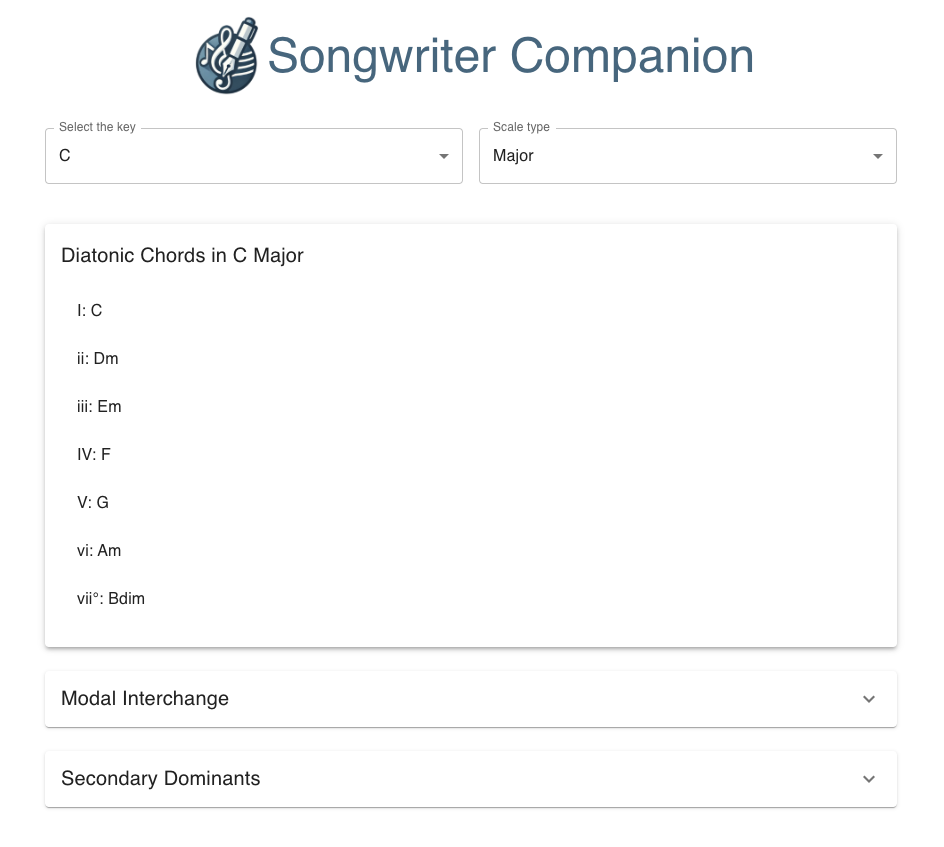

# Songwriter Companion

A web application designed to assist songwriters by providing chord suggestions based on the selected key and scale type. The app displays diatonic chords, modal interchange chords, and secondary dominants, helping you compose music more efficiently.

## Table of Contents

- [Features](#features)
- [Demo](#demo)
- [Installation](#installation)
- [Usage](#usage)
- [Technologies Used](#technologies-used)
- [Contributing](#contributing)
- [License](#license)
- [Contact](#contact)

## Features

- **Key and Scale Selection**: Choose any key and select between Major and Minor scales.
- **Diatonic Chords Display**: View all diatonic chords within the selected key and scale.
- **Modal Interchange Chords**: Explore chords borrowed from parallel modes.
- **Secondary Dominants**: Discover secondary dominant chords to add tension and interest to your compositions.
- **Responsive Design**: Optimized for both desktop and mobile devices using Material-UI's responsive utilities.

## Demo



View the webapp [HERE](https://songwritercompanion.netlify.app)

## Installation

### Prerequisites

- **Node.js** (v14 or higher recommended)
- **npm** (v6 or higher)

### Steps

1. **Clone the Repository**

   ```bash
   git clone https://github.com/yourusername/songwriter-companion.git
   cd songwriter-companion
   ```

2. **Install Dependencies**

   ```bash
   npm install
   ```

3. **Start the Development Server**

   ```bash
   npm start
   ```

The app should now be running on [http://localhost:3000](http://localhost:3000).

## Usage

### Select the Key

Use the dropdown menu to select the key you want to compose in. Both sharp and flat keys are available, and enharmonic equivalents are indicated (e.g., C# / Db).

### Select the Scale Type

Choose between Major and Minor scales to see the corresponding chords.

### Explore the Chords

- **Diatonic Chords**: These are the chords naturally found within the selected key and scale.
- **Modal Interchange**: Chords borrowed from the parallel mode, allowing you to add variety.
- **Secondary Dominants**: Dominant chords that resolve to diatonic chords other than the tonic.

### Responsive Interface

The app adjusts its layout based on your device, ensuring a seamless experience on both mobile and desktop platforms.

## Technologies Used

- **React**: A JavaScript library for building user interfaces.
- **Material-UI (MUI)**: React components for faster and easier web development.
- **@mui/material**: Core UI components.
- **@mui/icons-material**: Material Design icons.
- **JavaScript (ES6+)**: Modern JavaScript features.
- **HTML5 & CSS3**: Markup and styling.
- **npm Scripts**: For running and building the app.

## Contributing

Contributions are welcome! Please follow these steps:

1. **Fork the Repository**

   Click on the 'Fork' button on the top right to create a copy of the repository on your GitHub account.

2. **Clone Your Fork**

   ```bash
   git clone https://github.com/yourusername/songwriter-companion.git
   cd songwriter-companion
   ```

3. **Create a New Branch**

   ```bash
   git checkout -b feature/YourFeatureName
   ```

4. **Make Your Changes**

    - Ensure code follows the existing style.
    - Write clear commit messages.

5. **Commit and Push**

   ```bash
   git commit -m "Add feature: YourFeatureName"
   git push origin feature/YourFeatureName
   ```

6. **Submit a Pull Request**

    - Go to the original repository and click on 'Pull Requests'.
    - Submit your pull request for review.

## License

This project is licensed under the MIT License.

*Note: Include a LICENSE file in your repository if you choose to specify a license.*

## Contact

For any questions or suggestions, feel free to reach out:

- **GitHub**: [stefanoesposito](https://github.com/stefanoesposito)